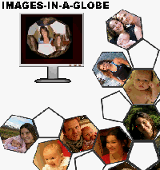



## Images\-in\-a\-Globe

### Description

Put your Photos and Images collection into a Paper Globe.

Requires 1024 x 768 resolution (1280x1024 is better)

Attention! You can get money with this.
 
### More Info
 

             |
---                |---
**Submitted On**   |2006-11-10 08:09:14
**By**             |[Agustin Rodriguez](https://github.com/Planet-Source-Code/PSCIndex/blob/master/ByAuthor/agustin-rodriguez.md)
**Level**          |Intermediate
**User Rating**    |5.0 (30 globes from 6 users)
**Compatibility**  |VB 6\.0
**Category**       |[Graphics](https://github.com/Planet-Source-Code/PSCIndex/blob/master/ByCategory/graphics__1-46.md)
**World**          |[Visual Basic](https://github.com/Planet-Source-Code/PSCIndex/blob/master/ByWorld/visual-basic.md)
**Archive File**   |[Images\-in\-20305011122006\.zip](https://github.com/Planet-Source-Code/agustin-rodriguez-images-in-a-globe__1-67071/archive/master.zip)

